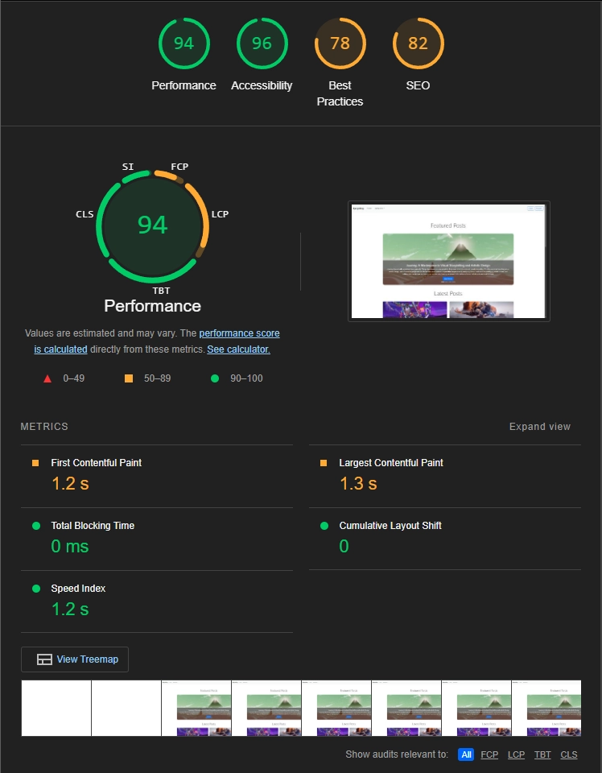
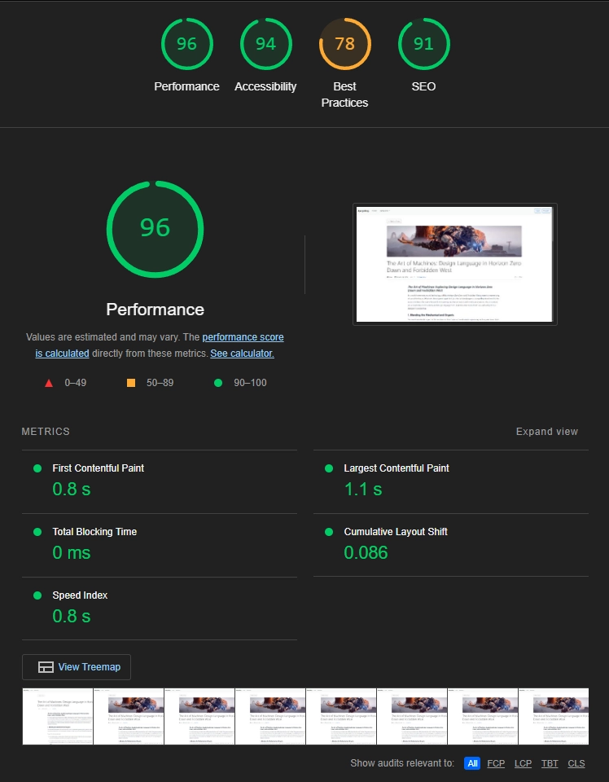
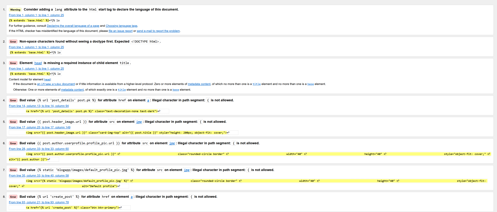

# Django-Blog

A modern, feature-rich blogging platform built with Django, featuring user authentication, rich text editing, article management, social interactions, and responsive design.

## Table of Contents
- [Project Overview](#project-overview)
- [Project Planning](#project-planning)
- [Features](#features)
  - [General Features](#general-features)
  - [Navigation & Hero](#navigation--hero)
  - [Featured Posts](#featured-posts)
  - [Article Feed](#article-feed)
  - [Post Details](#post-details)
  - [User Profiles](#user-profiles)
  - [Responsive Design](#responsive-design)
- [Technical Stack](#technical-stack)
- [AI Usage](#ai-usage)
- [Deployment](#deployment-process)
- [Testing](#testing)

## Project Overview
This Django-based blogging platform allows users to create, share, and interact with blog posts. It features a modern UI built with Bootstrap 5, rich text editing capabilities to allow for easy creation of articles with a wysiwyg approach and a robust user system that expands on Django's built in object to allow for the creation of more detailed user profiles. User settings have been approached with separation of concerns in mind; keeping profile realated fields such as bio's, social links, and profile pictures separate from more important account settings such as passwords and usernames.

## Project Planning

For my planning I created wireframes using Balsamiq to give me an idea of the overall structure of the majot web pages, and what initial features I wanted to implement for the MVP. I then made sure to plan the models I needed as best as I could, and create Entitiy Relationship Diagrams. When it came to coding, this prevented me running into a brick wall and having to refactor a lot of my code, as I already had a decent idea of how each model would interact with each other, and how data would be stored.

<div align="center">
  <div style="display: inline-block">
    
    <p><em>From left to right: Mobile, Home Page, Detail Page, Form Submission</em></p>
  </div>
</div>

<div align="center">
  <div style="display: inline-block">
    
    <p><em>ERD's</em></p>
  </div>
</div>

## Database Schema

When creating the database architecture I tried to keep each major component, such as Users, Posts and comments seperate, as well as maintiaining the correct data relationships between each of them. This will hopefully ensure optimal performance, scalability, and data integrity. Built in features such as Django's authentication means that sensitive user information is securely hashed before being stored in the database, and by maintaining correct database relationships, we can use features such as cascading deletes to prevent orphaned data.

#### User Authentication & Profiles
The user system extends Django's robust built-in authentication framework through a custom UserProfile model. This one-to-one relationship with Django's User model allows for enhanced user data storage while maintaining security. Each profile encompasses essential social features including customizable avatars (handled through Cloudinary integration), biographical information, and social media links. This extension provides a rich user experience while preserving the security benefits of Django's authentication system.

#### Blog Posts & Categories
The Post model is the core of this blogging site. It contains a variety of different field types to suit the data it stores. Each post maintains relationships with authors through foreign keys to the User model, while categories are handled through a many-to-many relationship allowing flexible content organization. The model includes fields for all the blog essentials - Titles, Tab tiles, Summaries and Body content, as well as many to many relationships for interactive data such as likes and comments. Header images are managed through Cloudinary integration, ensuring efficient media storage and delivery through a CDN, and allowing authors to upload images directly to the site. The rich text content is handled through Summernote integration, allowing for formatted text, code snippets, and embedded media in a WYSIWYG format - Meaning writers dont have to grapple with the concepts of HTML formatting just to style their posts.

#### Comments & Social Interactions
Comments are linked to both posts and users through foreign keys, with timestamps and moderation status fields such as booleans to indicate an edited status that could be expanded upon in the future to allow moderators to easily access stored comment history. The social interaction system, including likes and dislikes, utilizes many-to-many relationships between users and posts, allowing for efficient tracking of user engagement while preventing duplicate interactions. In the future I'd like to further expand this and allow for the creation of threads so users can reply and expand upon their ideas - or even just thank a user for a kind message.

#### Featured Posts Management
Featured content is managed through a dedicated database structure that extends the base Post model. This implementation allows for flexible content curation without duplicating data. Eventually i'd like to expand this system to include fields for controlling display order, feature duration, and custom presentation options. By linking content this way, se can dynamically curate and update the content from the backend, meaning superusers can easily make changes without having to touch the code itself.

Each of these components was designed with scalability and growth in mind, serving data dynamically from the back end in a way that we cannot do with a simple static site. Components such as Featured posts and Categories all work dynamically and don't rely on hard coded data, making them easy to maintain and update using Django's robust backend admin panel.

### User Roles
- Anonymous Users (read-only)
- Authenticated Users (create/edit posts, comment, like)
- Staff Users (additional privileges)
- Admin Users (full access)

### User Roles and Permissions

For the user system I planned to have several tiers of user, with the site presenting content differently depending on who was accessing it. For example, a random viewer could only access the site in a 'read-only' style mode with no access to interactive features, and an admin would have access to more high level features such as curating featured posts, or creating new categories.

#### Blog viewers
People who dont't have an account should have read-only access to the platform's public content. They can browse published blog posts, view user profiles, and explore categories. This limited access encourages user registration while still providing value to casual visitors. Anonymous users can see like counts and comments but must register to interact. This approach helps maintain content quality by preventing spam while showcasing the platform's social features. Likes and other interactive elements use Bootstrap's 'muted' class to give a visual indication that they cannot be interacted with.

#### Authenticated Users
Once registered and logged in, users gain access to the platform's interactive features. They can create their own blog posts, participate in discussions through comments, and engage with content through likes and dislikes. Each authenticated user receives a customizable profile page where they can share their bio, social media links, and upload a profile picture. They maintain full control over their content, with the ability to edit or delete their own posts and comments. The platform implements user-specific views that adapt the interface based on content ownership, showing edit and delete options only for the user's own content. Eventually I want to limit this functionality and keep the ability to create posts limited to only Staff members. This still allows for community engagement through profiles, comments, replies and likes - But keeps the content more tightly moderated, shifting towards more of a curated garden rather than a social media site. Content quality should come first, social media functions second.

#### Staff Users
Staff members is a planned role that will split some of the functionality currently assigned to authenticated users. Staff will have an easily identifiable flair that will separate them from registed users, and their social media links will be more geared towards 'professional' platforms such as LinkedIn, Github etc, rather than more generic socials like twitter/insta. Staff members should have all the interaction and engagement abilities of Authenticated users, but with the additional abilities to create posts, and have a user profile that is more geared towards a blog author, such as latest posts, user featured content etc.

#### Administrative Users
Administrators have comprehensive access to all platform features and settings. Through Django's admin interface, they can manage user accounts, oversee content moderation, and configure system settings. This includes the ability to create and manage staff accounts, configure site-wide settings, and access detailed user analytics. More advanced features such as curating site-wide featured posts, and adding new categories can be performed here. This keeps it more secure, and prevents a writer from accidentally deleting a whole category, or implementing a bias into featured content. It also allows administrators to access these more high level features without having to involve the development team or mess around in code.

### Role Implementation Details

The role system is implemented using Django's built-in authentication system, providing a robust out of the box solution that conforms to modern standards. Each role's capabilities are enforced through a combination of template logic, view decorators, and permission classes. This ensures consistent access control across the platform while maintaining clean, maintainable code.

Key security measures include:
- Session management with secure cookie handling
- CSRF protection for all form submissions
- Audit logging for administrative actions
- Secure password handling with Django's authentication backend

This robust role system allows the platform to grow while maintaining security and providing appropriate access levels for all users. Future expansions could include additional roles for specific needs, such as content editors or category moderators, without requiring significant architectural changes. Middleware could also be created to expand upon Django's auth system and provide additional features. Eventually I plan to move most of the auth logic to the backend, to make it more secure and less vunerable from attacks. Auth permissions should eventually all be checked with decorators, rather than using DTL and conditionals to perform it in the frontend.

## Features

### General Features
- **User authentication and authorization:** As mentioned above, this project makes full use of Django's powerful built in authentication system and conditional logic to dynamically allow access to CRUD functions, interactions, and admin tasks.

- **Rich text editing with code snippet support:** By implementing summernote into our project, post authors can make use of rich text editing to easily style their posts. Custom CSS extends these features and allows for displaying code snippits in an easy to read, visually appealing manner.

- **Cloudinary CDN:** Integrating Cloudinary into our blog allows media to be dynamically served to our site, and allows users to directly upload content when creating new posts.

- **Categories and tags organization:** Categories and a tagging system allows users to look for posts by category. For example, all the coding tutorials and posts. The category object is dynamically populated, allowing admins to add and remove entries.

- **Like/dislike functionality:** Likes and dislikes allow users to interact and drive engagement, letting other users see posts worth reading. Correct database relationships means these are correctly managed and handled between users and posts.

- **Commenting system:** A basic commenting system allows users to let their voices be heard! Full CRUD functionality means they can create, read, update and delete their comments - With auth checks to make sure that other users cant. Eventually this will be expanded upon to allow users to reply to each other, and start conversation threads.

- **User profiles with social links:** A robust user system (with signalling for user registration) gives new users their own profile page where they can set a bio, display their social links, and upload a profile picture utilizing our CDN.

### Navigation & Hero

- **Clean, responsive navigation bar:** The navigation system makes use of Bootstrap's powerful navbar component, automatically adapting to different screen sizes. The navbar collapses into a hamburger menu on mobile devices, ensuring a consistent experience across all platforms.

- **User dropdown menu with profile options:** Signed in users can access a dropdown user menu, personalized with their own profile picture. This menu allows them to access their profile, change user specific settings, and perform a logout. Keeping all the user features grouped and contained inside a single element for a modern look.

- **Category-based navigation:** Categories are dynamically populated in the navigation bar, allowing users to quickly filter posts by their interests. This system pulls directly from our database, meaning new categories can be added by administrators without touching the codebase.

- **Dynamic featured posts carousel:** The hero section showcases featured content through a Bootstrap carousel, automatically cycling through selected posts with smooth transitions. Each slide displays the post's header image, title, and a brief excerpt, encouraging user engagement. Touch-enabled controls make navigation intuitive on mobile devices, while keyboard controls provide accessibility for desktop users.

- **Seamless mobile navigation:** Thanks to bootstrap, we can make use of its built in responsive design, meaning our navbars, carousels and other content dynamically adjust to fit other screen sizes.

- **Search integration:** Eventually I want to integrate a search bar into the navigation header, with smart suggestions that allow users to find and discover new posts based on keywords or tags.

### Featured Posts
- **Hero carousel for featured content:** Bootstrap's carousel gives us a dynamic, scalable and responsive starting point.

- **Dynamic carousel slides:** By using Django template language to loop through the featured posts object, we don't have to worry about hard coding content or images. Text is dynamically pulled from our database and images are served from our CDN. Admins can set the featured posts in the backend, and the code will do the rest.

- **Responsive layout:** Thanks to Bootstrap, and some custom CSS/Media Queries, the content and sizing will dynamically adjust to work on different devices; from mobile phones to desktop browsers.

- **Automatic fallback for missing images:** By making use of Django Template language we can check for header images, then provide a fallback if none is found. The same logic is used inside of the article cards.

### Article Feed

- **Clean, card-based layout:** The main feed utilizes Bootstrap's card components to present blog posts in a visually appealing grid layout. Each card maintains consistent dimensions while accommodating varying content lengths, creating a clean and organized appearance. Cards will always maintain a consistent height too, meaning two cards placed together will always align nicely, even if the content is different lengths. Additional CSS provides subtle shadows and animations to the layout to give it some more character, and help it stand out.

- **Post previews with images:** Each article card displays a preview image pulled from the post's header image, then served through our Cloudinary CDN. If no image is available, we use Django conditional logic in the template to display a placeholder. Simillarly, Preview text is automatically generated from the post content and truncated if no summary text was given when the post was created.

- **Author information display:** Each card includes a compact author widget showing their profile picture, name, and posting date. This information is presented in an unobtrusive yet accessible manner, helping users quickly identify content sources. 

- **Category tags:** Posts are organized with visually distinct category tags that use Bootstrap's badge component. Eventually, these could be expanded into distinct categories, and then additional searchable tags to make the post easier to find once the blog grows in size.

- **Like/Comment counters:** Social engagement metrics are displayed through intuitive icons and counters, showing the number of likes and comments at a glance. These counters update dynamically when users interact with posts, providing immediate feedback. For non-authenticated users, these elements appear in a muted state to indicate interactivity requires login.

- **Pagination:** Simple pagination is achieved with Django's built in functions, preventing pages being too long and difficult to scroll, or having large amounts of data to serve at once.

- **Responsive grid system:** The card layout automatically adjusts its grid structure based on viewport size, ensuring optimal content presentation across all devices. On mobile devices, cards stack single-column for easy scrolling, while larger screens display multiple columns for efficient space utilization.

### Post Details

- **Full article display:** This layout view displays the content in full, using appropriate styling to present the body content in a visually appealing, accessible manner. Headers, Sub-Headings, and body text are all appropriately styled to maintain hierarchy, and custom CSS allows for elements such as code snippets to be presented in the body text.

- **Syntax-highlighted code blocks:** Technical content is enhanced through Summernote's code block feature, Eventually i'd like to expand this to include proper indentation and line numbering, with a copy-to-clipboard button for user convenience. Language specific highlighting could also make this more readable.

- **Author widget with social links:** Each post includes a prominent author section displaying their profile picture, bio, and social media links. This widget helps readers connect with authors and discover more of their content.

- **Comments section:** The commenting system allows readers to engage in discussions about the post content. Comments support basic formatting and include user avatars and timestamps. Comment authors can edit or delete their contributions. Eventually this will be expanded upon to allow users to reply and have proper conversations. Moderation roles will also need to be created once comment functionality grows to combat spam and offensive posts. A word filter could be implemented provide some kind of base level moderation.

- **Like/Dislike functionality:** Social interaction features allow readers to express their response to posts through like and dislike buttons. These interactions are handled asynchronously for smooth user experience, with real-time counter updates. The system prevents duplicate interactions and provides visual feedback for user actions by switching icons from bootstraps library to indicate if you have already liked or disliked content.

- **Related posts suggestions:** In the future, a related posts section could be included to use the tags and categories to reccomend and serve related content, to further drive user engagement.

- **Edit/Delete options for authors:** Content creators can manage their posts through easily accessible edit and delete options. These controls are only visible to post authors and administrators, implementing proper permission checks. The edit interface maintains all original post formatting and media, while delete actions require confirmation to prevent accidental removal.

### User Profiles

- **Custom profile pages:** Upon sign up, we use signalling to make sure users are also registered in the UserProfile model. This prevents conflicts in IDs as it means a user with pk 1 could still be successfully registered to a profile with a pk of 4. Profiles allow staff to describe themselves, show off their posts, and link to their other social medias. They also give users some personalization, and allow them to set a profile - and in the future - view their likes and comment history.

- **Social media integration:** Users can connect their social media accounts through easily manageable profile settings. The platform supports multiple social platforms including GitHub, LinkedIn, Twitter, and personal websites. Social links are displayed through recognizable icons and integrate with the platform's overall design, while maintaining appropriate security through proper URL validation.

- **Profile picture management:** Using our Cloudinary CDN, users can upload their own profile pictures instead of relying on preset static images. DTL logic means that we can still serve a static fallback image if a user doesnt currently have a profile picture.


### Responsive Design

- **Bootstrap 5 framework:** Bootstrap gives a great starting point that comes with built in responsive design features to cater for all screen sizes, and give some consistent styling that can be expanded upon with custom CSS.

- **Responsive images:** Image handling implements multiple optimization strategies for different viewport sizes. Cloudinary's responsive image capabilities automatically serve appropriately sized images based on device characteristics. The system uses srcset and sizes attributes for optimal image loading, while maintaining aspect ratios through CSS. Lazy loading is implemented for images below the fold to improve initial page load performance.

- **Touch-friendly interactions:** All interactive elements are designed with touch interfaces in mind. Buttons and links have appropriate touch target sizes (minimum 44x44px), with sufficient spacing to prevent accidental taps. Touch gestures are supported for common actions like carousel navigation and menu access. Hover states are properly handled on touch devices to prevent sticky hover effects.

- **Adaptive layouts:** The layout system dynamically adjusts based on available screen space. Navigation collapses into a hamburger menu on smaller screens, while content areas reorganize for optimal readability. Card grids adjust their column count fluidly, and text containers maintain comfortable line lengths across different screen sizes. Margin and padding values scale proportionally using relative units.

## Technical Stack

- **Django 4.x Framework:** The project is built on Django's latest stable release, taking advantage of its robust features including:
  - Class-based views for consistent code organization
  - Built-in authentication system with custom user model extensions
  - Template engine with inheritance and custom tags
  - Admin interface customized for content management
  - Security features including CSRF protection and password hashing

- **Python 3.x:** Utilizing modern Python features for clean, maintainable code:
  - Async capabilities for performance optimization
  - Modern package management with pip and virtual environments

- **Bootstrap 5:** Frontend framework implementation including:
  - Responsive grid system for layout management
  - Custom component styling and modifications
  - JavaScript plugins for interactive features
  - Mobile-first design approach

- **PostgreSQL Database:** Production-grade database chosen for:
  - Robust data integrity and relationship management
  - Scalable performance
  - Backup and recovery features
  - JSON field support for flexible data storage

- **Cloudinary Integration:** Media management system providing:
  - Automated image optimization and formatting
  - Responsive image delivery
  - Secure upload handling
  - CDN distribution for global performance

- **Summernote Editor:** Rich text editing solution offering:
  - WYSIWYG interface for content creation
  - Custom toolbar configuration
  - Image upload integration with Cloudinary
  - Code snippet formatting
  - Responsive editing experience
  - Cross-browser compatibility

### AI Usage

During the development of this blog project, I utilized GitHub Copilot as an AI assistant in several key areas:

#### Database Migration
Copilot helped me create custom management commands for migrating my data from SQLite to PostgreSQL. For example:

```python
python manage.py dumpdata > data.json
python manage.py migrate
python manage.py loaddata data.json
```

It also assisted with writing scripts to transfer media files to Cloudinary, ensuring no content was lost during the migration process. This is something that is way out of my skill level, and was out of scope for this project, so having copilot avaliable to create these for me saved a considerable amount of time, and meant that I didnt have to recreate all my database entries.

#### Infrastructure Choices
As this was my first ever full-stack project, I was unsure of what services I could use to host my data. By asking copilot for suggestions, and giving it my requirements for the project, I narrowed it down to the following:
- Neon for PostgreSQL hosting due to its generous free tier and automatic backups
- Cloudinary for media storage because of its easy Django integration and free tier

#### Deployment Process
Copilot guided me through the Heroku deployment process, helping identify necessary dependencies:
```txt
gunicorn==21.2.0
whitenoise==6.6.0
psycopg2-binary==2.9.9
django-cloudinary-storage==0.3.0
```

#### Code Quality
When using AI to check over my code for erros, and perform basic validation checks it helped me improve aspects of it by suggesting things such as:
- Using decorators for authentication checks instead of template logic
- Implementing proper error handling
- Setting up secure user permissions
- Optimizing database queries

#### Example Authentication Implementation
Copilot proved very useful in adhering to Django's best practices, for example, after following a tutorial i'd used a lot of template language for checks. This is obviously not a good idea as it is better to perform auth checks in the backend. Copilot then reminded me and guided me on using decorators to perform this function.

```python
# Before (in template):

    <button>Edit Post</button>


# After (in views.py):
@login_required
def edit_post(request, pk):
    # View logic here
```

#### Copilot summary
Whilst using copilot as a crutch is a bad idea, and it wont write a whole program for you, it has worked as an excellent assistant here. It has pointed me to key parts of django that I wasnt aware of, and furthered my skills and knowledge of the framework. It also worked as a guide to help me thorough the more complex parts of the process that I was unsure on, such as deployment, and assisted in testing my functions to make sure I hadn't made any glaring errors. I can then perform further testing and validation to check for anything copilot may have missed.

### Deployment Process

The deployment process involved several steps to move from local development to a live production environment:

#### 1. Database Migration (SQLite to PostgreSQL)
- Created account on Neon.tech for PostgreSQL hosting
- Set up new database instance with provided credentials
- Modified database settings in Django:
```python
DATABASES = {
    'default': dj_database_url.parse(os.environ.get("DATABASE_URL"))
}
```
- Migrated local data using custom management commands:
```python
python manage.py dumpdata > data.json
python manage.py migrate
python manage.py loaddata data.json
```

#### 2. Media Storage (Cloudinary Setup)
- Created Cloudinary account for media hosting
- Installed required packages:
```bash
pip install cloudinary django-cloudinary-storage
```
- Added Cloudinary configuration to settings.py:
```python
INSTALLED_APPS = [
    'cloudinary_storage',
    'django.contrib.staticfiles',
    'cloudinary',
]

CLOUDINARY_STORAGE = {
    'CLOUD_NAME': 'your-cloud-name',
    'API_KEY': 'your-api-key',
    'API_SECRET': 'your-api-secret'
}

DEFAULT_FILE_STORAGE = 'cloudinary_storage.storage.MediaCloudinaryStorage'
```
- Migrated existing media files to Cloudinary

#### 3. Heroku Deployment
- Created new Heroku application
- Installed required dependencies:
```txt
gunicorn==21.2.0
whitenoise==6.6.0
psycopg2-binary==2.9.9
django-cloudinary-storage==0.3.0
dj-database-url==2.1.0
```
- Created Procfile with gunicorn configuration:
```txt
web: gunicorn django_blog.wsgi
```
- Set up environment variables in Heroku:
  - DATABASE_URL
  - CLOUDINARY_URL
  - SECRET_KEY
  - DEBUG
  - ALLOWED_HOSTS

#### 4. Static Files Configuration
- Configured WhiteNoise for static file handling:
```python
MIDDLEWARE = [
    # ...
    'whitenoise.middleware.WhiteNoiseMiddleware',
]

STATIC_ROOT = os.path.join(BASE_DIR, 'staticfiles')
STATICFILES_STORAGE = 'whitenoise.storage.CompressedManifestStaticFilesStorage'
```
- Collected static files:
```bash
python manage.py collectstatic
```

#### 5. Final Deployment Steps
- Pushed code to GitHub repository
- Connected Heroku to GitHub repository
- Enabled automatic deployments from main branch
- Performed initial manual deployment
- Verified all features working in production environment

This deployment process ensures:
- Secure database hosting with automatic backups
- Efficient media file delivery through CDN
- Proper static file handling
- Scalable production environment

### Testing


#### Lighthouse Testing
<div align="center">
  <div style="display: inline-block; width: 45%;">
    
    <p><em>Home Page Lighthouse</em></p>
  </div>
  <div style="display: inline-block; width: 45%;">
    
    <p><em>Details Page Lighthouse</em></p>
  </div>
</div>

Lighthouse performance on my two major pages was good, although there could be some improvements. Performance seemed excellent, as it scored in the 90s, which considering the page was hosted on an eco dyno, and the content was being dynamically served using a free plan, seemed great and I dont think i could improve on.
Accessibility was also great, although by creating a high contrast mode I could bring this up to a 100.  

The areas where I need to improve on are best practices and SEO for the home page. My best practices was due to pages being served as HTTP instead of a more secure HTTPS. This is something I can easily address, and will make sure to in future versions. SEO is down to the missing meta description tags, and lack of descriptive links, as I hadn't been able to add ARIA labels and such to all my elements yet. These are also things I can easily address to bring the overall scores up.

#### PEP8 Testing
After validating my python with the PEP8 standards my results are mostly good, however A lot of my classes and functions are missing docstrings to explain what they do, and the way I have created comments is currently not best practices as Lines should not be longer than 79 characters (E501). As my code is deployed and functional, I will leave it as is for now, as I dont want to start making major formatting changes so close to the deadline in case I cause any errors or break features that I dont have time to fix. In future versions I will need to simplify and clean up my comments, moving them into a simple docstring instead to better conform to Python standards.

#### HTML Validation
HTML validation seemed successful, with the only errors being where I was using Django Template language, as this is not allowed in vanilla HTML. In production this shouldn't matter however.
<div align="center">
  <div style="display: inline-block; width: 80%">
    
    <p><em>HTML Validation Results</em></p>
  </div>
</div>